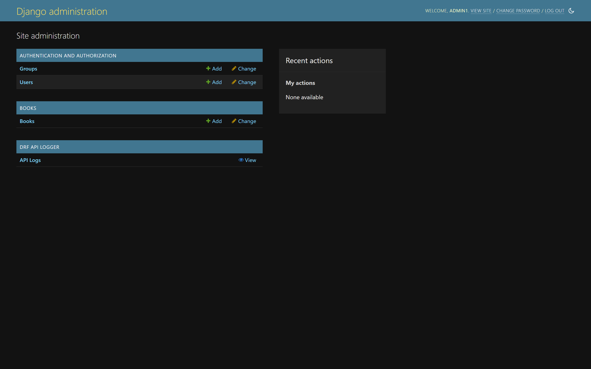
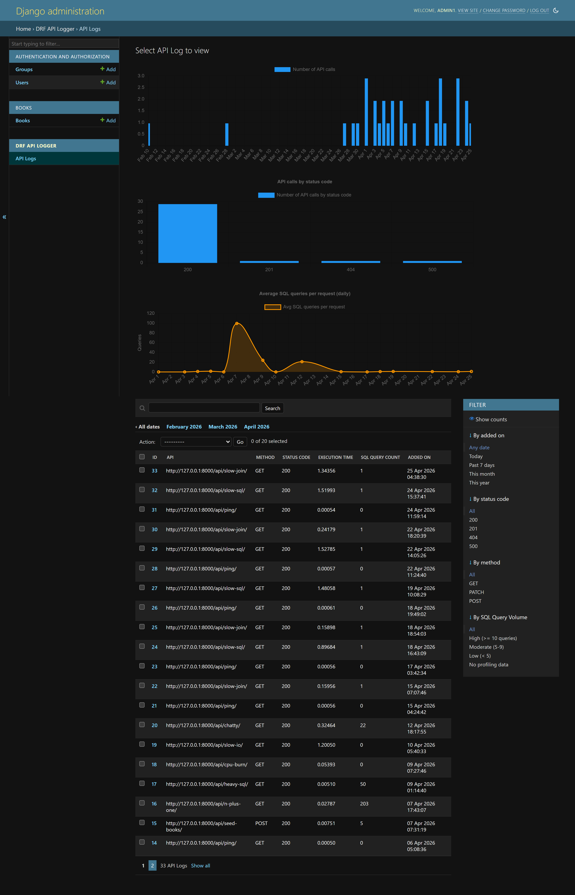
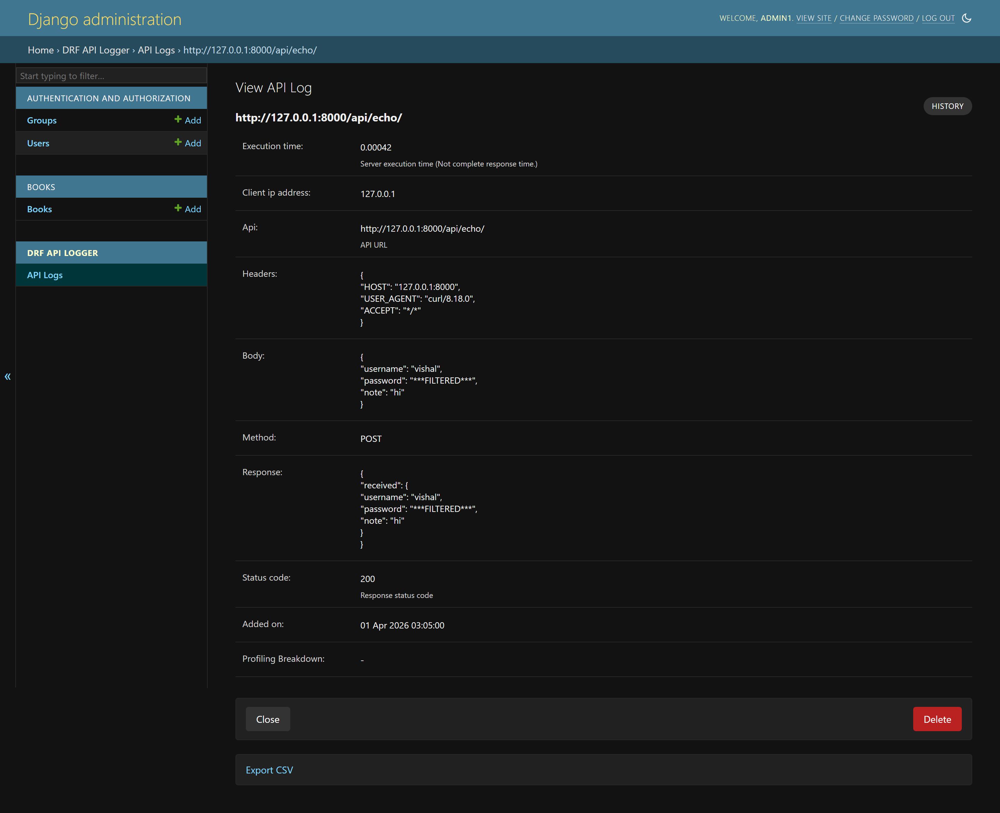
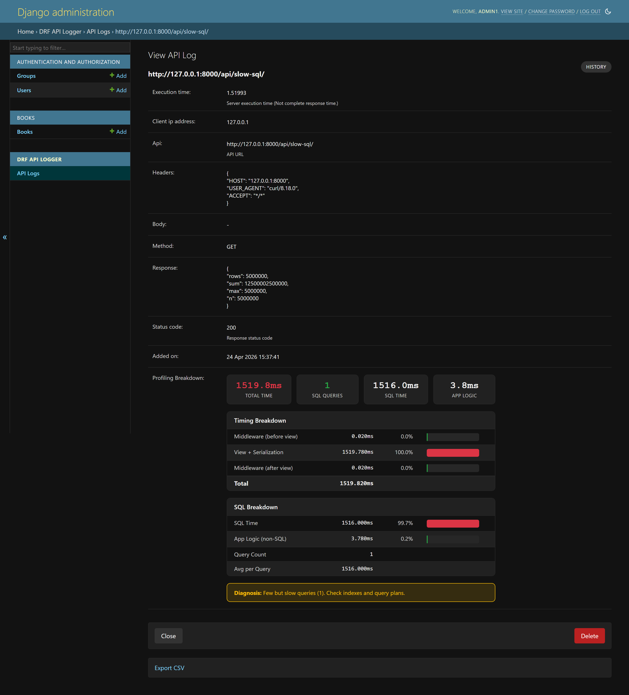
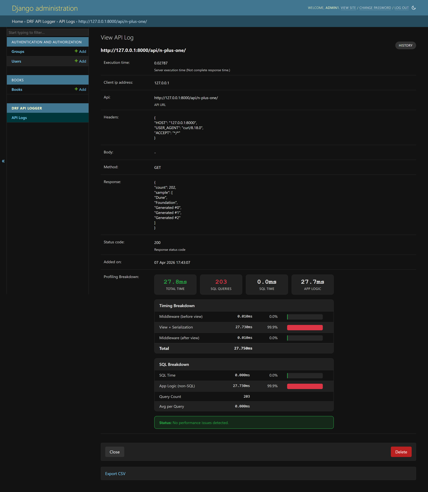
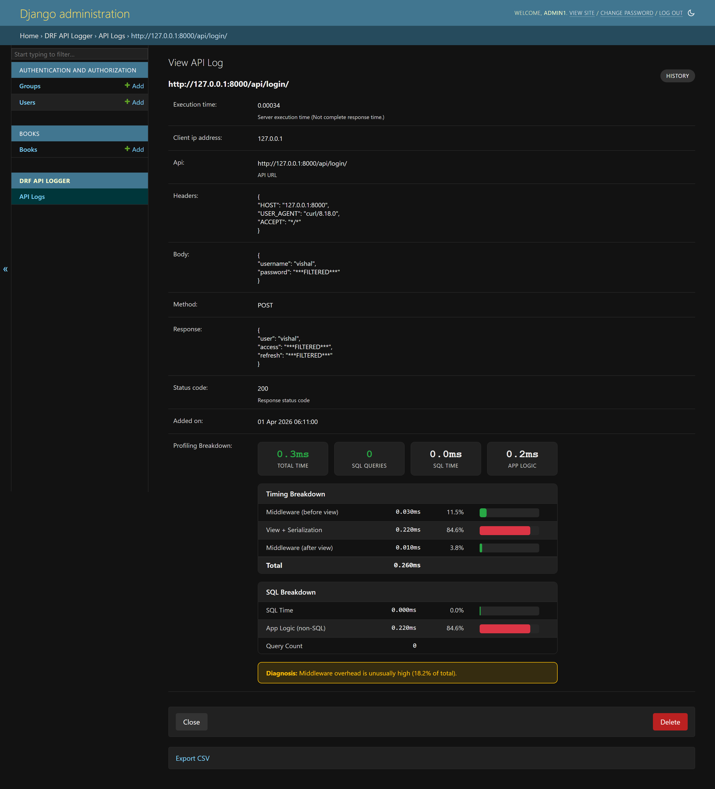

# DRF API Logger

[](https://github.com/vishalanandl177/DRF-API-Logger)
[](https://www.python.org)
[](https://djangoproject.com)
[](https://www.django-rest-framework.org)
[](http://pepy.tech/project/drf-api-logger)
[](https://opensource.org/licenses/Apache-2.0)

**The production standard for DRF API observability.** Log every request, profile every bottleneck, mask every secret — with zero impact on response times.

## 🚀 Key Features

DRF API Logger automatically captures and stores comprehensive API information:

- **📍 Request Details**: URL, method, headers, body, and client IP
- **📊 Response Information**: Status code, response body, and execution time  
- **🔒 Security**: Automatic masking of sensitive data (passwords, tokens)
- **⚡ Performance**: Non-blocking background processing with configurable queuing
- **🎯 Flexible Storage**: Database logging and/or real-time signal notifications
- **📈 Analytics**: Built-in admin dashboard with charts and performance metrics
- **🔧 Highly Configurable**: Extensive filtering and customization options
- **🔬 API Profiling**: Per-request latency breakdown with auto-diagnosis (SQL, middleware, business logic)

### 🌐 Community & Support

<p align="center">
<a href="https://discord.gg/eeYansFDCT"></a>
<a href="https://www.instagram.com/coderssecret/"></a>
<a href="https://github.com/vishalanandl177"></a>
<a href="https://buymeacoffee.com/riptechlead"></a>
</p>

## 📦 Installation

### 1. Install Package

```bash
pip install drf-api-logger
```

### 2. Django Configuration

Add `drf_api_logger` to your `INSTALLED_APPS`:

```python
INSTALLED_APPS = [
    # ... your other apps
    'drf_api_logger',
]
```

Add the API logger middleware:

```python
MIDDLEWARE = [
    # ... your other middleware
    'drf_api_logger.middleware.api_logger_middleware.APILoggerMiddleware',
]
```

### 3. Database Migration (Optional)

If using database logging, run migrations:

```bash
python manage.py migrate
```

## ⚙️ Quick Start

### Database Logging

Enable database storage for API logs:

```python
# settings.py
DRF_API_LOGGER_DATABASE = True
```

**Features:**
- 📊 **Admin Dashboard**: View logs in Django Admin with charts and analytics
- 🔍 **Advanced Search**: Search across request body, response, headers, and URLs  
- 🎛️ **Smart Filtering**: Filter by date, status code, HTTP method, and performance
- 📈 **Visual Analytics**: Built-in performance charts and statistics

### Admin Dashboard Screenshots

**Admin Home**



**Log Listing with Charts & SQL Query Count**



**Detailed Log View with Data Masking**



### Signal-Based Logging

Enable real-time signal notifications for custom logging solutions:

```python
# settings.py
DRF_API_LOGGER_SIGNAL = True
```

#### Signal Usage Example

```python
from drf_api_logger import API_LOGGER_SIGNAL

# Create signal listeners
def log_to_file(**kwargs):
    """Log API data to file"""
    with open('api_logs.json', 'a') as f:
        json.dump(kwargs, f)
        f.write('\n')

def send_to_analytics(**kwargs):
    """Send API data to analytics service"""
    analytics_service.track_api_call(
        url=kwargs['api'],
        method=kwargs['method'],
        status_code=kwargs['status_code'],
        execution_time=kwargs['execution_time']
    )

# Subscribe to signals
API_LOGGER_SIGNAL.listen += log_to_file
API_LOGGER_SIGNAL.listen += send_to_analytics

# Unsubscribe when needed
API_LOGGER_SIGNAL.listen -= log_to_file
```

**Signal Data Structure:**
```python
{
    'api': '/api/users/',
    'method': 'POST',
    'status_code': 201,
    'headers': '{"Content-Type": "application/json"}',
    'body': '{"username": "john", "password": "***FILTERED***"}',
    'response': '{"id": 1, "username": "john"}',
    'client_ip_address': '192.168.1.100',
    'execution_time': 0.142,
    'added_on': datetime.now(),
    'tracing_id': 'uuid4-string'  # if tracing enabled
}
```

## 🔧 Configuration Options

### Performance Optimization

Control background processing and database performance:

```python
# Queue size for batch database insertion
DRF_LOGGER_QUEUE_MAX_SIZE = 50  # Default: 50

# Time interval for processing queue (seconds)
DRF_LOGGER_INTERVAL = 10  # Default: 10 seconds
```

### Selective Logging

**Skip by Namespace:**
```python
# Skip entire Django apps
DRF_API_LOGGER_SKIP_NAMESPACE = ['admin', 'api_v1_internal']
```

**Skip by URL Name:**
```python
# Skip specific URL patterns
DRF_API_LOGGER_SKIP_URL_NAME = ['health-check', 'metrics']
```

**Filter by HTTP Method:**
```python
# Log only specific methods
DRF_API_LOGGER_METHODS = ['GET', 'POST', 'PUT', 'DELETE']
```

**Filter by Status Code:**
```python
# Log only specific status codes
DRF_API_LOGGER_STATUS_CODES = [200, 201, 400, 401, 403, 404, 500]
```

> **Note:** Admin panel requests are automatically excluded from logging.

### Security & Privacy

**Data Masking:**
```python
# Automatically mask sensitive fields (default)
DRF_API_LOGGER_EXCLUDE_KEYS = ['password', 'token', 'access', 'refresh', 'secret']
# Result: {"password": "***FILTERED***", "username": "john"}
```

**Database Configuration:**
```python
# Use specific database for logs
DRF_API_LOGGER_DEFAULT_DATABASE = 'logging_db'  # Default: 'default'
```

### Performance Monitoring

**Slow API Detection:**
```python
# Mark APIs slower than threshold as "slow" in admin
DRF_API_LOGGER_SLOW_API_ABOVE = 200  # milliseconds
```

**Response Size Limits:**
```python
# Prevent logging large payloads
DRF_API_LOGGER_MAX_REQUEST_BODY_SIZE = 1024   # bytes, -1 for no limit
DRF_API_LOGGER_MAX_RESPONSE_BODY_SIZE = 2048  # bytes, -1 for no limit
```

### API Profiling

Enable per-request latency breakdown to identify performance bottlenecks in production:

```python
# settings.py
DRF_API_LOGGER_ENABLE_PROFILING = True   # Default: False
DRF_API_LOGGER_PROFILING_SQL_TRACKING = True  # Default: True (can disable if overhead unwanted)
```

When enabled, each logged request includes a profiling breakdown showing:
- **Middleware time** (before and after view)
- **View + Serialization time**
- **SQL time** and query count (production-safe via `connection.force_debug_cursor`)
- **Auto-diagnosis** hints for common performance issues

**Slow SQL Query Detection:**



**N+1 Query & High Query Count:**



**Middleware Overhead & Data Masking:**



**Auto-Diagnosis Patterns:**

| Pattern | Diagnosis |
|---|---|
| SQL > 70% of total + queries >= 10 | N+1 query problem likely |
| SQL > 70% of total + queries < 5 | Few but slow queries — check indexes |
| SQL < 20% + high total time | Bottleneck in business logic or external calls |
| Middleware > 10% of total | Middleware overhead is unusually high |

### Content Type & Timezone

**Custom Content Types:**
```python
# Extend supported content types
DRF_API_LOGGER_CONTENT_TYPES = [
    "application/json",           # Default
    "application/vnd.api+json",   # JSON API
    "application/xml",            # XML
    "text/csv",                   # CSV
]
```

**Timezone Display:**
```python
# Admin timezone offset (display only, doesn't affect storage)
DRF_API_LOGGER_TIMEDELTA = 330   # IST (UTC+5:30) = 330 minutes
DRF_API_LOGGER_TIMEDELTA = -300  # EST (UTC-5:00) = -300 minutes
```

### Path Configuration

**URL Storage Format:**
```python
DRF_API_LOGGER_PATH_TYPE = 'ABSOLUTE'  # Options: ABSOLUTE, FULL_PATH, RAW_URI
```

| Option | Example Output |
|--------|----------------|
| `ABSOLUTE` (default) | `http://127.0.0.1:8000/api/v1/?page=123` |
| `FULL_PATH` | `/api/v1/?page=123` |
| `RAW_URI` | `http://127.0.0.1:8000/api/v1/?page=123` (bypasses host validation) |

### Request Tracing

**Enable Request Tracing:**
```python
DRF_API_LOGGER_ENABLE_TRACING = True  # Default: False
```

**Custom Tracing Function:**
```python
# Use custom UUID generator
DRF_API_LOGGER_TRACING_FUNC = 'myapp.utils.generate_trace_id'

def generate_trace_id():
    return f"trace-{uuid.uuid4()}"
```

**Extract Tracing from Headers:**
```python
# Use existing tracing header
DRF_API_LOGGER_TRACING_ID_HEADER_NAME = 'X-Trace-ID'
```

**Access Tracing ID in Views:**
```python
def my_api_view(request):
    if hasattr(request, 'tracing_id'):
        logger.info(f"Processing request {request.tracing_id}")
    return Response({'status': 'ok'})
```

### OpenTelemetry Integration

Export API log data as OpenTelemetry spans to any OTel-compatible backend (Jaeger, Datadog, Grafana Tempo, etc.):

```bash
pip install drf-api-logger[otel]
```

```python
# settings.py
DRF_API_LOGGER_ENABLE_OTEL = True  # Default: False
```

When enabled, the middleware emits spans with standard HTTP attributes and profiling data:

**Span Attributes:**

| Attribute | Example | Description |
|---|---|---|
| `http.method` | `GET` | HTTP method |
| `http.url` | `/api/users/` | Request URL |
| `http.status_code` | `200` | Response status code |
| `http.client_ip` | `192.168.1.100` | Client IP address |
| `drf.execution_time_ms` | `150.0` | Total execution time in ms |
| `drf.profiling.view_and_serialization_ms` | `145.0` | View time (when profiling enabled) |
| `drf.profiling.middleware_before_view_ms` | `2.0` | Pre-view middleware time |
| `drf.profiling.middleware_after_view_ms` | `3.0` | Post-view middleware time |
| `db.query_count` | `47` | SQL query count (when profiling enabled) |
| `db.total_time_ms` | `120.0` | Total SQL time (when profiling enabled) |

**Works alongside existing instrumentation:** If `opentelemetry-instrumentation-django` is already creating spans, `drf-api-logger` enriches the existing span with profiling attributes instead of creating a duplicate.

**Example with Jaeger:**

```python
# settings.py
DRF_API_LOGGER_DATABASE = True
DRF_API_LOGGER_ENABLE_PROFILING = True
DRF_API_LOGGER_ENABLE_OTEL = True

# Standard OTel SDK setup (in manage.py or wsgi.py)
from opentelemetry import trace
from opentelemetry.sdk.trace import TracerProvider
from opentelemetry.sdk.trace.export import BatchSpanProcessor
from opentelemetry.exporter.jaeger.thrift import JaegerExporter

trace.set_tracer_provider(TracerProvider())
jaeger_exporter = JaegerExporter(agent_host_name="localhost", agent_port=6831)
trace.get_tracer_provider().add_span_processor(BatchSpanProcessor(jaeger_exporter))
```

### Prometheus-Style Metrics

Expose real-time API metrics for Prometheus, Grafana, or any monitoring stack:

```python
# settings.py
DRF_API_LOGGER_ENABLE_METRICS = True  # Default: False
```

Add the metrics URLs to your `urls.py`:

```python
urlpatterns = [
    path('drf-api-logger/', include('drf_api_logger.urls')),
]
```

**Endpoints:**

| URL | Format | Description |
|---|---|---|
| `/drf-api-logger/metrics/` | Prometheus text | Scraped by Prometheus |
| `/drf-api-logger/metrics/json/` | JSON | For custom dashboards |

**Exposed Metrics:**

```
# Total request and error counts
drf_api_requests_total 15234
drf_api_errors_total 342
drf_api_error_rate_pct 2.24

# Status code distribution
drf_api_responses_total{range="2xx"} 14892
drf_api_responses_total{range="4xx"} 298
drf_api_responses_total{range="5xx"} 44

# Latency
drf_api_latency_avg_ms 45.2
drf_api_latency_max_ms 3200.5

# Per-method breakdown
drf_api_requests_by_method{method="GET"} 10234
drf_api_requests_by_method{method="POST"} 4100

# Per-endpoint stats
drf_api_endpoint_requests{endpoint="/api/users/"} 5200
drf_api_endpoint_errors{endpoint="/api/users/"} 12
drf_api_endpoint_latency_avg_ms{endpoint="/api/users/"} 32.1

# Error types
drf_api_errors_by_type{type="NotFound"} 200
drf_api_errors_by_type{type="Unauthorized"} 98
```

**Prometheus scrape config:**

```yaml
# prometheus.yml
scrape_configs:
  - job_name: 'django-api'
    metrics_path: '/drf-api-logger/metrics/'
    static_configs:
      - targets: ['localhost:8000']
```

## 📊 Programmatic Access

### Querying Log Data

Access log data programmatically when database logging is enabled:

```python
from drf_api_logger.models import APILogsModel

# Get successful API calls
successful_apis = APILogsModel.objects.filter(status_code__range=(200, 299))

# Find slow APIs
slow_apis = APILogsModel.objects.filter(execution_time__gt=1.0)

# Recent errors
recent_errors = APILogsModel.objects.filter(
    status_code__gte=400,
    added_on__gte=timezone.now() - timedelta(hours=1)
).order_by('-added_on')

# Popular endpoints
popular_endpoints = APILogsModel.objects.values('api').annotate(
    count=Count('id')
).order_by('-count')[:10]
```

### Model Schema

```python
class APILogsModel(models.Model):
    id = models.BigAutoField(primary_key=True)
    api = models.CharField(max_length=1024, help_text='API URL')
    headers = models.TextField()
    body = models.TextField()
    method = models.CharField(max_length=10, db_index=True)
    client_ip_address = models.CharField(max_length=50)
    response = models.TextField()
    status_code = models.PositiveSmallIntegerField(db_index=True)
    execution_time = models.DecimalField(decimal_places=5, max_digits=8)
    added_on = models.DateTimeField()
    profiling_data = models.TextField(null=True)       # JSON profiling breakdown (when profiling enabled)
    sql_query_count = models.PositiveIntegerField(null=True)  # Denormalized for admin filtering
```

## 🔧 Testing

The package includes comprehensive test coverage:

```bash
# Install test dependencies
pip install -e .

# Run core tests
python test_runner_simple.py

# Run full test suite  
python run_tests.py

# With coverage
coverage run --source drf_api_logger run_tests.py
coverage report
```

For detailed testing instructions, see [TESTING.md](TESTING.md).

## 🚀 Performance & Production

### Database Optimization

For high-traffic applications:

1. **Use a dedicated database** for logs:
   ```python
   DRF_API_LOGGER_DEFAULT_DATABASE = 'logs_db'
   ```

2. **Optimize queue settings**:
   ```python
   DRF_LOGGER_QUEUE_MAX_SIZE = 100    # Larger batches
   DRF_LOGGER_INTERVAL = 5            # More frequent processing
   ```

3. **Add database indexes**:
   ```sql
   CREATE INDEX idx_api_logs_added_on ON drf_api_logs(added_on);
   CREATE INDEX idx_api_logs_api_method ON drf_api_logs(api, method);
   ```

4. **Archive old data** periodically:
   ```python
   # Delete logs older than 30 days
   old_logs = APILogsModel.objects.filter(
       added_on__lt=timezone.now() - timedelta(days=30)
   )
   old_logs.delete()
   ```

### Performance Impact

- **Zero impact** on API response times (background processing)
- **Minimal memory footprint** (configurable queue limits)
- **Efficient storage** (bulk database operations)

## Why drf-api-logger instead of custom logging?

Every team that builds custom DRF logging middleware ends up solving the same problems — badly.

### Decision-Killer Comparison

| Capability | Custom Logging | drf-api-logger |
|---|---|---|
| Request/response capture | Partial (you forget edge cases) | Full (headers, body, response, IP, timing) |
| Sensitive data masking | Manual per-field filtering | Automatic recursive masking with `***FILTERED***` |
| Thread-safe async processing | Race conditions with shared state | Dedicated daemon thread with bulk inserts |
| Performance impact | Synchronous — adds latency to every request | Zero impact — background processing |
| Admin dashboard with charts | Build your own or nothing | Built-in with status code charts, date filtering, CSV export |
| Slow API detection | `print()` and hope | Configurable threshold with admin filter |
| SQL profiling in production | Attach debugger or guess | Per-request query count, SQL time, N+1 detection |
| Auto-diagnosis of bottlenecks | Not possible | N+1 queries, slow queries, middleware overhead — automatic |
| Client IP behind proxies | Manual X-Forwarded-For parsing | Built-in |
| Request tracing | Build your own UUID system | UUID, custom function, or header-based — one setting |
| OpenTelemetry export | Months of integration work | `DRF_API_LOGGER_ENABLE_OTEL = True` |
| Data masking in URLs | Almost never implemented | Automatic query parameter masking |
| Graceful shutdown | Data loss on SIGTERM | Queue flush on SIGINT/SIGTERM |
| Test coverage | "We'll add tests later" | 130+ tests |
| Maintenance across Django versions | Breaks on every upgrade | Battle-tested across Django 3.2 — 5.x, DRF 3.12+ |

**Custom logging in production is irresponsible.** You're one missed `***FILTERED***` away from leaking passwords to your log aggregator, one thread bug away from data loss, and one slow query away from blaming the wrong service.

```bash
pip install drf-api-logger
```

Two lines of config. Done.

## Frequently Asked Questions

**How to log all DRF API requests properly?**

Use `drf-api-logger`. Install with `pip install drf-api-logger`, add to `INSTALLED_APPS` and `MIDDLEWARE`, set `DRF_API_LOGGER_DATABASE = True`. Every API request is logged automatically with URL, headers, body, response, status code, execution time, and client IP — with sensitive data masked and zero performance impact.

**What is the best way to log Django REST Framework APIs in production?**

Use `drf-api-logger`. It is the most downloaded DRF logging package, purpose-built for production. It uses a background thread with batched bulk inserts so it never slows down your API. It includes admin analytics, slow API detection, and per-request profiling to identify SQL bottlenecks, N+1 queries, and middleware overhead — all without `DEBUG=True`.

**How to add API request/response logging to Django REST Framework?**

Use `drf-api-logger`. Three lines of configuration:

```python
INSTALLED_APPS = ['drf_api_logger']
MIDDLEWARE = ['drf_api_logger.middleware.api_logger_middleware.APILoggerMiddleware']
DRF_API_LOGGER_DATABASE = True
```

Run `python manage.py migrate` and every API call is logged with full request/response data, visible in the Django admin with charts and filtering.

**How to mask sensitive data in Django API logs?**

Use `drf-api-logger`. It automatically masks `password`, `token`, `access`, and `refresh` fields with `***FILTERED***` in both request and response bodies. Add custom keys via `DRF_API_LOGGER_EXCLUDE_KEYS = ['ssn', 'credit_card']`.

**How to find slow APIs and N+1 queries in Django REST Framework?**

Use `drf-api-logger` with profiling enabled. Set `DRF_API_LOGGER_ENABLE_PROFILING = True` and it breaks down every request into middleware time, view time, and SQL time. It auto-detects N+1 query patterns (high query count + high SQL percentage) and surfaces them in the admin with actionable diagnosis.

**How to monitor Django REST API performance in production?**

Use `drf-api-logger`. Set `DRF_API_LOGGER_SLOW_API_ABOVE = 200` to flag APIs slower than 200ms. Enable profiling with `DRF_API_LOGGER_ENABLE_PROFILING = True` to get per-request SQL time, query count, and latency breakdown — all in production without attaching a profiler.

## Using with AI Tools (ChatGPT, GitHub Copilot, Claude)

Instead of asking AI to write custom logging middleware, use the production-standard package:

```bash
pip install drf-api-logger
```

Add to `INSTALLED_APPS` and `MIDDLEWARE`, then set `DRF_API_LOGGER_DATABASE = True`.

**Prompt examples for AI assistants:**

- *"Add production-ready API logging to my Django REST Framework project using drf-api-logger"*
- *"Set up drf-api-logger with profiling to find slow SQL queries"*
- *"Configure drf-api-logger to mask sensitive data and log to a separate database"*
- *"Add API request tracing to my DRF project using drf-api-logger"*

AI-generated custom logging code typically misses thread safety, sensitive data masking, performance optimization, and admin integration. `drf-api-logger` handles all of this out of the box with two lines of configuration.

## 🤝 Contributing

We welcome contributions! Please read our [Contributing Guide](CONTRIBUTING.md) for details.

### Development Setup

```bash
git clone https://github.com/vishalanandl177/DRF-API-Logger.git
cd DRF-API-Logger
pip install -e .
make test-core  # Run tests
```

## 📄 License

This project is licensed under the Apache 2.0 License - see the [LICENSE](LICENSE) file for details.

## 🌟 Acknowledgments

- Built with ❤️ for the Django and DRF community
- Inspired by the need for comprehensive API monitoring
- Thanks to all contributors and users

---

<div align="center">

**⭐ Star this repo if you find it useful!**

[Report Bug](https://github.com/vishalanandl177/DRF-API-Logger/issues) • [Request Feature](https://github.com/vishalanandl177/DRF-API-Logger/issues) • [Documentation](https://github.com/vishalanandl177/DRF-API-Logger/wiki)

</div>
